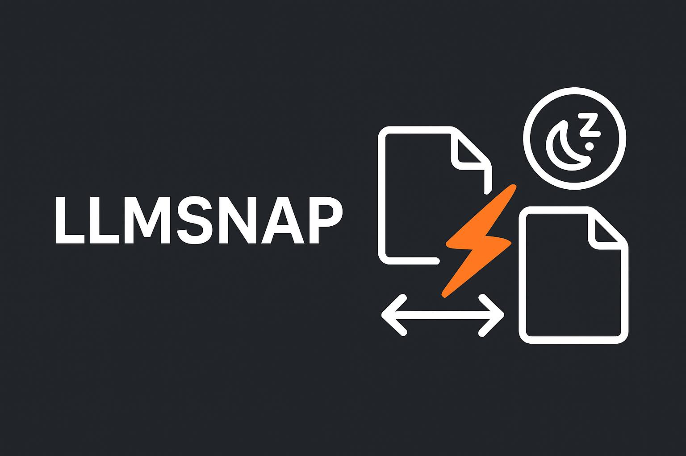

# llmsnap

Run multiple LLM models on your machine and hot-swap between them as needed. llmsnap works with any OpenAI API-compatible server, giving you the flexibility to switch models without restarting your applications.

Built in Go for performance and simplicity, llmsnap has zero dependencies and is incredibly easy to set up. Get started in minutes - just one binary and one configuration file.

## Features:

- ✅ Easy to deploy and configure: one binary, one configuration file. no external dependencies
- ✅ On-demand model switching
- ✅ Use any local OpenAI compatible server (llama.cpp, vllm, tabbyAPI, etc.)
  - future proof, upgrade your inference servers at any time.
- ✅ OpenAI API supported endpoints:
  - `v1/completions`
  - `v1/chat/completions`
  - `v1/embeddings`
  - `v1/audio/speech` ([#36](https://github.com/mostlygeek/llama-swap/issues/36))
  - `v1/audio/transcriptions` ([docs](https://github.com/mostlygeek/llama-swap/issues/41#issuecomment-2722637867))
- ✅ Anthropic API supported endpoints:
  - `v1/messages`
- ✅ llama-server (llama.cpp) supported endpoints
  - `v1/rerank`, `v1/reranking`, `/rerank`
  - `/infill` - for code infilling
  - `/completion` - for completion endpoint
- ✅ llmsnap API
  - `/ui` - web UI
  - `/upstream/:model_id` - direct access to upstream server ([demo](https://github.com/mostlygeek/llama-swap/pull/31))
  - `/models/unload` - manually unload running models ([#58](https://github.com/mostlygeek/llama-swap/issues/58))
  - `/models/sleep/:model_id` - put a model to sleep (requires sleep/wake configuration)
  - `/running` - list currently running models ([#61](https://github.com/mostlygeek/llama-swap/issues/61))
  - `/log` - remote log monitoring
  - `/health` - just returns "OK"
- ✅ Customizable
  - Run multiple models at once with `Groups` ([#107](https://github.com/mostlygeek/llama-swap/issues/107))
  - Automatic unloading of models after timeout by setting a `ttl`
  - Fast model switching with sleep/wake support (vLLM sleep mode, offload memory instead of full restart)
  - Reliable Docker and Podman support using `cmd` and `cmdStop` together
  - Preload models on startup with `hooks` ([#235](https://github.com/mostlygeek/llama-swap/pull/235))

### Web UI

llmsnap includes a real time web interface for monitoring logs and controlling models:


The Activity Page shows recent requests:


## Installation

llmsnap can be installed in multiple ways

1. Docker
2. Homebrew (OSX and Linux)
3. From release binaries
4. From source

### Docker Install ([download images](https://github.com/napmany/llmsnap/pkgs/container/llmsnap))

Nightly container images with llmsnap and llama-server are built for multiple platforms (cuda, vulkan, intel, etc.) including [non-root variants with improved security](docs/container-security.md).

```shell
$ docker pull ghcr.io/napmany/llmsnap:cuda

# run with a custom configuration and models directory
$ docker run -it --rm --runtime nvidia -p 9292:8080 \
 -v /path/to/models:/models \
 -v /path/to/custom/config.yaml:/app/config.yaml \
 ghcr.io/napmany/llmsnap:cuda

# configuration hot reload supported with a
# directory volume mount
$ docker run -it --rm --runtime nvidia -p 9292:8080 \
 -v /path/to/models:/models \
 -v /path/to/custom/config.yaml:/app/config.yaml \
 -v /path/to/config:/config \
 ghcr.io/napmany/llmsnap:cuda -config /config/config.yaml -watch-config
```

<details>
<summary>
more examples
</summary>

```shell
# pull latest images per platform
docker pull ghcr.io/napmany/llmsnap:cpu
docker pull ghcr.io/napmany/llmsnap:cuda
docker pull ghcr.io/napmany/llmsnap:vulkan
docker pull ghcr.io/napmany/llmsnap:intel
docker pull ghcr.io/napmany/llmsnap:musa

# tagged llmsnap, platform and llama-server version images
docker pull ghcr.io/napmany/llmsnap:v0.0.1-cuda-b7342

# non-root cuda
docker pull ghcr.io/napmany/llmsnap:cuda-non-root

```

</details>

### Homebrew Install (macOS/Linux)

```shell
brew tap napmany/llmsnap
brew install llmsnap
llmsnap --config path/to/config.yaml --listen localhost:8080
```

### Pre-built Binaries

Binaries are available on the [release](https://github.com/napmany/llmsnap/releases) page for Linux, Mac, Windows and FreeBSD.

### Building from source

1. Building requires Go and Node.js (for UI).
1. `git clone https://github.com/napmany/llmsnap.git`
1. `make clean all`
1. look in the `build/` subdirectory for the llmsnap binary

## Configuration

```yaml
# minimum viable config.yaml

models:
  model1:
    cmd: llama-server --port ${PORT} --model /path/to/model.gguf
```

That's all you need to get started:

1. `models` - holds all model configurations
2. `model1` - the ID used in API calls
3. `cmd` - the command to run to start the server.
4. `${PORT}` - an automatically assigned port number

Almost all configuration settings are optional and can be added one step at a time:

- Advanced features
  - `groups` to run multiple models at once
  - `hooks` to run things on startup
  - `macros` reusable snippets
- Model customization
  - `ttl` to automatically unload models
  - `aliases` to use familiar model names (e.g., "gpt-4o-mini")
  - `env` to pass custom environment variables to inference servers
  - `cmdStop` gracefully stop Docker/Podman containers
  - `useModelName` to override model names sent to upstream servers
  - `${PORT}` automatic port variables for dynamic port assignment
  - `filters` rewrite parts of requests before sending to the upstream server

See the [configuration documentation](docs/configuration.md) for all options.

## How does llmsnap work?

When a request is made to an OpenAI compatible endpoint, llmsnap will extract the `model` value and load the appropriate server configuration to serve it. If the wrong upstream server is running, it will be replaced with the correct one. This is where the "swap" part comes in. The upstream server is automatically swapped to handle the request correctly.

In the most basic configuration llmsnap handles one model at a time. For more advanced use cases, the `groups` feature allows multiple models to be loaded at the same time. You have complete control over how your system resources are used.

## Reverse Proxy Configuration (nginx)

If you deploy llmsnap behind nginx, disable response buffering for streaming endpoints. By default, nginx buffers responses which breaks Server‑Sent Events (SSE) and streaming chat completion. ([#236](https://github.com/mostlygeek/llama-swap/issues/236))

Recommended nginx configuration snippets:

```nginx
# SSE for UI events/logs
location /api/events {
    proxy_pass http://your-llmsnap-backend;
    proxy_buffering off;
    proxy_cache off;
}

# Streaming chat completions (stream=true)
location /v1/chat/completions {
    proxy_pass http://your-llmsnap-backend;
    proxy_buffering off;
    proxy_cache off;
}
```

As a safeguard, llmsnap also sets `X-Accel-Buffering: no` on SSE responses. However, explicitly disabling `proxy_buffering` at your reverse proxy is still recommended for reliable streaming behavior.

## Monitoring Logs on the CLI

```shell
# sends up to the last 10KB of logs
curl http://host/logs'

# streams combined logs
curl -Ns 'http://host/logs/stream'

# just llama-swap's logs
curl -Ns 'http://host/logs/stream/proxy'

# just upstream's logs
curl -Ns 'http://host/logs/stream/upstream'

# stream and filter logs with linux pipes
curl -Ns http://host/logs/stream | grep 'eval time'

# skips history and just streams new log entries
curl -Ns 'http://host/logs/stream?no-history'
```

## Do I need to use llama.cpp's server (llama-server)?

Any OpenAI compatible server would work.

For Python based inference servers like vllm or tabbyAPI it is recommended to run them via podman or docker. This provides clean environment isolation as well as responding correctly to `SIGTERM` signals for proper shutdown.

## Star History

> [!NOTE]
> ⭐️ Star this project to help others discover it!

[](https://www.star-history.com/#napmany/llmsnap&Date)
